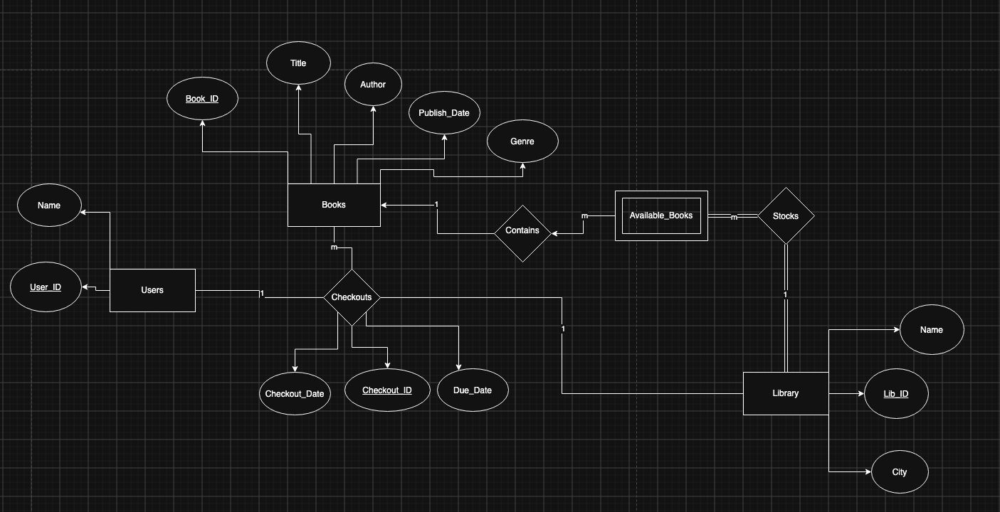

# Dbase-Final-Project

## Tables: 
- Books –-> book_id(pk), title, author, publish_date, genre 
- Users –-> name, user_id(pk) 
- Checkouts (relationship) –-> checkout_id(pk) + book_id(fk) + user_id(fk) + lib_id(fk), checkout_date, due_date 
- Library –-> city, name, lib_id(pk)
- Available_Books (for each library location) -> (lib_id (fk), book_id(fk))(pk)

## Features:
1.	browse all books
2.	search bar (more comprehensive feature)
     Search by author, 
      Genre, 
      Name, 
  	Book ID
4.	Viewing book availability for each library location
5.	Checkout a book

## Constraints & Business Rules
- Every checkout record must link to a valid user_id, book_id, and lib_id.
- A book must exist in Available_Books at a lib_id to be checked out from that branch.
- Upon checkout, a new user_id and checkout_id are created for the user.
- Can only checkout book via book ID

## Use Cases

### USE CASE 1: BROWSE ALL BOOKS

**Brief Use Case Description:**
A user navigates to the library catalog to view all available book titles stored in the system

**User Stories:**
As a user, I want to browse all available books in the system so that I can discover new titles to read.

**Acceptance Criteria:**
- AC-01.1 — The catalog view must display a complete list of all books stored in the database.
- AC-01.2 — Each book entry shown must display the title, author, genre, and publication date.
- AC-01.3 — If no books exist in the database, the system must display a clear "No books available" message.

### USE CASE 2: SEARCH BOOKS

**Brief Use Case Description:**
A user inputs text into a search bar to filter the book catalog by author name, book title, or genre.

**User Stories:**
As a user, I want to search books by author, genre, or title so that I can quickly find topics or writers I enjoy.

**Acceptance Criteria:**
- AC-02.1 — The search interface must include a text input search bar and a Submit action.
- AC-02.2 — Entering a query must return all records matching the text across book title, author, or genre fields.
- AC-02.3 — If no matching books are found, the system must present a "No books found matching your search" message.

### USE CASE 3: VIEW BOOK AVAILABILITY BY LOCATION

**Brief Use Case Description:**
A user selects a specific book from the catalog to see which library locations currently carry said book.

**User Stories:**
As a user, I want to see which library branches has my desired book so that I know where I can check it out.

**Acceptance Criteria:**
- AC-03.1 — Selecting a book must display an option to view location availability.
- AC-03.2 — The system must list all library branch names and their cities where the selected book is registered in inventory.

### USE CASE 4: CHECKOUT A BOOK

**Brief Use Case Description:**
A user selects an available book at a branch, provides their name, and completes the checkout process. The system generates a new user ID and transaction checkout ID upon completion.

**User Stories:**
As a user, I want to enter my name during checkout so that I can borrow a book and receive an assigned tracking ID and return deadline.

Acceptance Criteria:
- AC-04.1 — The checkout screen must require the user to enter their full name before completing the transaction.
- AC-04.2 — Submitting an empty or whitespace only name field must prevent the checkout and prompt for a valid name.
- AC-04.3 — Upon successful submission, the system must automatically create a new user_id and a unique checkout_id.
- AC-04.4 — The system must record the transaction with the current date and calculate an accurate return due date.
- AC-04.5 — A success confirmation showing the generated checkout_id, assigned user_id, and due_date must be displayed to the user.

### USE CASE 5: VIEW BOOKS BY LIBRARY LOCATION
**Brief Use Case Description:**
As a user, I want to select a specific library location branch to view the catalog of books stocked and available at that particular branch.

**User Stories:**
As a user, I want to select a library branch so that I can see which books are currently stocked at that location.

**Acceptance Criteria:**
- AC-05.1 — The system must allow the user to select or filter by a specific library branch using lib_id or library name.
- AC-05.2 — Upon branch selection, the system must query Available_Books and display only the books stocked at that specified library location.
- AC-05.3 — Each listed book entry must display its title, author, genre, publication date, and stock status for that branch.
- AC-05.4 — If the selected library branch currently has no books in stock, the system must display a message reading "No books available at this library location."

### USE CASE 6: VIEW ALL CHECKED OUT BOOKS
**Brief Use Case Description:**
Any librarian can view a list of all active book checkouts, including details about the user, book title, checkout location, and due date.

**User Stories:**
As a staff of the library, I want to view all active book checkouts so that I can track borrowed books, check due dates, and manage library operations.

**Acceptance Criteria:**
- AC-06.1 — The system must display a comprehensive list of active checkout records retrieved from the Checkouts table.
- AC-06.2 — Each checkout record displayed must include the checkout_id, book title (book_id), user name (user_id), branch name (lib_id), checkout_date, and due_date.
- AC-06.3 — If there are no active checkouts in the system, the display must show a clear "No checked out books" message.

## ER Diagram

## Schema Design

### Strong Entities: 
 
- Books (book_id(pk), title, author, publish_date, genre) 
- Users (name, user_id(pk)) 
- Library (city, name, lib_id(pk)) 
 

### Weak Entities: 
 
- Available_Books (for each library location) -> (lib_id (fk), book_id(fk)) (pk) 
- FK Reference: Lib_ID: Library(Lib_ID), Book_ID: Books(Book_ID) 
 
 
### Relations Tables: 
 
- Checkouts (checkout_id(pk) + book_id(fk) + user_id(fk) + lib_id(fk), checkout_date, due_date) 
- FK Reference: User_ID: User(User_ID), Lib_ID:Library(lib_ID), Book_ID:Books(Book_ID) 
 
- Stocks (lib_ID) 
- FK Reference: Lib_ID: Library(lib_ID) 

- Contains (Book_ID) 
- FK Reference: Book_ID: Book(Book_ID)
